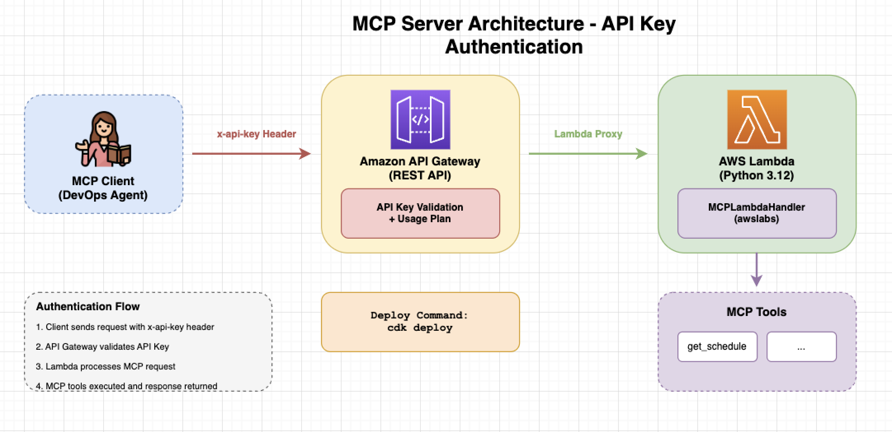
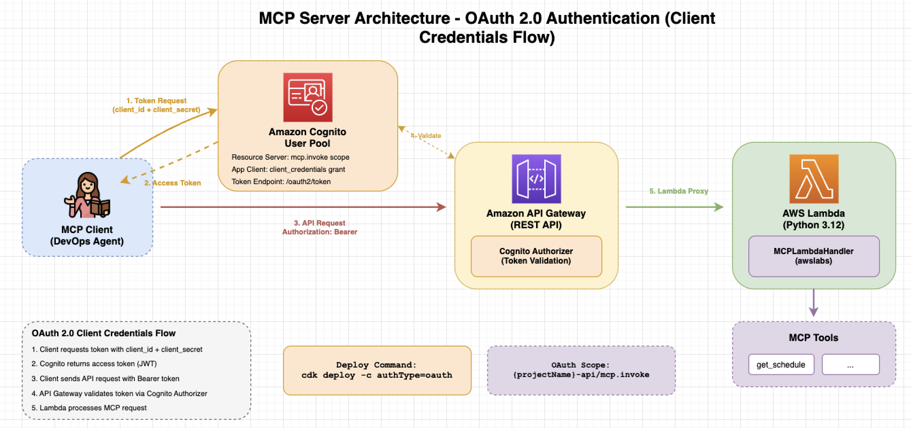

# MCP Server CDK

AWS Lambda 上で動作する MCP (Model Context Protocol) Server のサンプル実装です。AWS CDK でインフラを管理します。

## AWS DevOps Agent 対応

本プロジェクトは、**AWS DevOps Agent** から使用するための MCP サーバーを Lambda で構築するものです。

以下の AWS ドキュメントに基づき、必要な仕様を満たす実装となっています：

- [Configuring capabilities for AWS DevOps Agent: Connecting MCP servers](https://docs.aws.amazon.com/devopsagent/latest/userguide/configuring-capabilities-for-aws-devops-agent-connecting-mcp-servers.html)

### 対応仕様

| 要件 | 対応状況 |
|------|:--------:|
| Streamable HTTP トランスポート | ✅ |
| API キー/トークンベースの認証 | ✅ |
| OAuth 2.0 認証 (Client Credentials Flow) | ✅ |
| VPC 内ホスト未サポート | ✅ (VPC 設定なし) |
| JSON-RPC 2.0 | ✅ |

### サンプル実装について

本プロジェクトはサンプル実装のため、**最小限の Tool のみ**を提供しています。

| ツール名 | 説明 |
|---------|------|
| `get_schedule` | サービス運用のスケジュールを取得 |

実際のプロジェクトでは、`cdk/lambda_python/index.py` に Tool を追加して拡張してください。

## アーキテクチャ

2種類の認証方式をサポートしています。

### API Key 認証（デフォルト）




### OAuth 2.0 認証（Client Credentials Flow）



## サーバー情報

| 項目 | 値 |
|------|-----|
| サーバー名 | `service-operations-mcp` |
| バージョン | `1.0.0` |
| プロトコル | Streamable HTTP |

## 提供ツール

| ツール名 | 説明 | 引数 | 戻り値 |
|---------|------|------|--------|
| `get_schedule` | サービス運用のスケジュールを取得 | なし | JSON |

## 構成

```
mcp-server-aws-devops/
├── assets/
│   ├── architecture-api-key.drawio  # API Key認証構成図
│   └── architecture-oauth.drawio    # OAuth認証構成図
├── cdk/                             # CDKプロジェクト
└── README.md
```

### CDK ディレクトリ

```
cdk/
├── bin/
│   └── cdk.ts              # CDKエントリーポイント
├── lib/
│   └── mcp-stack.ts        # メインスタック（認証切り替え対応）
├── lambda_python/
│   ├── index.py            # Lambda関数実装 (Python)
│   └── requirements.txt    # Python依存関係
├── cdk.json                # CDK設定（authType設定含む）
├── package.json            # 依存関係
└── tsconfig.json           # TypeScript設定
```

## 認証方式

### 認証タイプの切り替え

`cdk.json` の `context.authType` または デプロイ時の `-c authType=` オプションで切り替えます。

| authType | 説明 | 認証方法 |
|----------|------|----------|
| `api-key` (デフォルト) | API Key認証 | `x-api-key` ヘッダー |
| `oauth` | OAuth 2.0 (Client Credentials) | `Authorization: Bearer <token>` ヘッダー |

### API Key 認証で作成されるリソース

| リソース | 説明 |
|---------|------|
| Lambda関数 | MCP Server (Python 3.12) |
| API Gateway | REST API (APIキー認証) |
| API Key | APIキー認証用 |
| Usage Plan | スロットリング設定（rate: 100, burst: 200） |

### OAuth 認証で作成されるリソース

| リソース | 説明 |
|---------|------|
| Lambda関数 | MCP Server (Python 3.12) |
| API Gateway | REST API (Cognito Authorizer) |
| Cognito User Pool | OAuth 2.0 IdP |
| Cognito Domain | トークンエンドポイント用 |
| Resource Server | スコープ定義 (`mcp.invoke`) |
| App Client | Client Credentials Flow 用 |

## awslabs.mcp_lambda_handler について

`awslabs.mcp_lambda_handler` は、AWS Labs が提供する Python ライブラリで、AWS Lambda 上で MCP サーバーを構築するためのフレームワークです。

- **PyPI**: [awslabs.mcp-lambda-handler](https://pypi.org/project/awslabs.mcp-lambda-handler/)
- **GitHub**: [awslabs/mcp](https://github.com/awslabs/mcp)

### 主な機能

| 機能 | 説明 |
|------|------|
| Streamable HTTP | MCP仕様の Streamable HTTP トランスポートをサポート |
| ツール定義 | `@mcp.tool()` デコレータで簡単にツールを定義 |
| セッション管理 | DynamoDB を使用したセッション状態の永続化（オプション） |
| 型検証 | 関数の引数・戻り値の型を自動検証 |

### 基本的な使い方

```python
from awslabs.mcp_lambda_handler import MCPLambdaHandler

mcp = MCPLambdaHandler(
    name="my-mcp-server",
    version="1.0.0",
)

@mcp.tool()
def my_tool(param1: str, param2: int = 10) -> str:
    """ツールの説明"""
    return f"Result: {param1}, {param2}"

def handler(event, context):
    return mcp.handle_request(event, context)
```

### サポートするMCPメソッド

| メソッド | 説明 |
|---------|------|
| `initialize` | クライアント接続の初期化 |
| `tools/list` | 登録されたツール一覧を返す |
| `tools/call` | 指定されたツールを実行 |
| `ping` | ヘルスチェック |

## セットアップ

### 前提条件

- Node.js 18+
- Docker（Lambda関数のバンドリングに必要）
- AWS CLI（設定済み）

### デプロイ

#### API Key 認証（デフォルト）

```bash
cd cdk
npm install
npx cdk deploy
```

#### OAuth 認証

```bash
cd cdk
npm install
npx cdk deploy -c authType=oauth
```

#### カスタムプロジェクト名を指定

```bash
npx cdk deploy -c projectName=my-mcp-server
npx cdk deploy -c projectName=my-mcp-server -c authType=oauth
```

## 出力値

### 共通出力

| 出力名 | 説明 |
|-------|------|
| `McpFunctionArn` | Lambda関数のARN |
| `McpApiUrl` | API GatewayのベースURL |
| `McpApiEndpoint` | MCPエンドポイント (`{ApiUrl}/mcp`) |
| `AuthType` | 使用中の認証タイプ |

### API Key 認証時の追加出力

| 出力名 | 説明 |
|-------|------|
| `ApiKeyId` | APIキーID |
| `GetApiKeyCommand` | APIキー値取得コマンド |

### OAuth 認証時の追加出力

| 出力名 | 説明 |
|-------|------|
| `UserPoolId` | Cognito User Pool ID |
| `AppClientId` | Cognito App Client ID |
| `TokenEndpoint` | OAuth 2.0 Token Endpoint URL |
| `OAuthScope` | 使用するスコープ |
| `GetClientSecretCommand` | Client Secret 取得コマンド |

## デプロイ後の作業

### API Key 認証の場合

#### APIキーの取得

```bash
# 出力されたコマンドを実行、または以下を実行
aws apigateway get-api-key \
  --api-key <ApiKeyId> \
  --include-value \
  --query 'value' \
  --output text
```

### OAuth 認証の場合

#### Client Secret の取得

```bash
# 出力された GetClientSecretCommand を実行
aws cognito-idp describe-user-pool-client \
  --user-pool-id <UserPoolId> \
  --client-id <AppClientId> \
  --query 'UserPoolClient.ClientSecret' \
  --output text
```

#### アクセストークンの取得

```bash
# Client Credentials Flow でトークンを取得
curl -X POST "<TokenEndpoint>" \
  -H "Content-Type: application/x-www-form-urlencoded" \
  -u "<AppClientId>:<ClientSecret>" \
  -d "grant_type=client_credentials&scope=<OAuthScope>"
```

レスポンス例:
```json
{
  "access_token": "eyJraWQiOi...",
  "expires_in": 3600,
  "token_type": "Bearer"
}
```

## 動作確認

### API Key 認証の場合

#### MCP Inspector での確認

```bash
npx @modelcontextprotocol/inspector \
  --transport streamable-http \
  --url "<McpApiEndpoint>" \
  --header "x-api-key: <API_KEY>"
```

#### tools/list の呼び出し

```bash
curl -X POST "<McpApiEndpoint>" \
  -H "x-api-key: <API_KEY>" \
  -H "Content-Type: application/json" \
  -d '{
    "jsonrpc": "2.0",
    "method": "tools/list",
    "id": 1
  }'
```

#### get_schedule ツールの呼び出し

```bash
curl -X POST "<McpApiEndpoint>" \
  -H "x-api-key: <API_KEY>" \
  -H "Content-Type: application/json" \
  -d '{
    "jsonrpc": "2.0",
    "method": "tools/call",
    "params": {
      "name": "get_schedule",
      "arguments": {}
    },
    "id": 2
  }'
```

### OAuth 認証の場合

#### tools/list の呼び出し

```bash
# まずアクセストークンを取得
ACCESS_TOKEN=$(curl -s -X POST "<TokenEndpoint>" \
  -H "Content-Type: application/x-www-form-urlencoded" \
  -u "<AppClientId>:<ClientSecret>" \
  -d "grant_type=client_credentials&scope=<OAuthScope>" \
  | jq -r '.access_token')

# Bearer トークンで API を呼び出し
curl -X POST "<McpApiEndpoint>" \
  -H "Authorization: Bearer $ACCESS_TOKEN" \
  -H "Content-Type: application/json" \
  -d '{
    "jsonrpc": "2.0",
    "method": "tools/list",
    "id": 1
  }'
```

#### get_schedule ツールの呼び出し

```bash
curl -X POST "<McpApiEndpoint>" \
  -H "Authorization: Bearer $ACCESS_TOKEN" \
  -H "Content-Type: application/json" \
  -d '{
    "jsonrpc": "2.0",
    "method": "tools/call",
    "params": {
      "name": "get_schedule",
      "arguments": {}
    },
    "id": 2
  }'
```

## MCP仕様への適合

| 仕様 | 対応状況 |
|------|:--------:|
| Streamable HTTP | ✅ |
| APIキー/トークンベースの認証 | ✅ |
| OAuth 2.0 認証 | ✅ |
| JSON-RPC 2.0 | ✅ |

## 注意事項

### 認証情報の管理

APIキーおよびOAuthクレデンシャルは機密情報です。以下の点に注意してください：

- コードやログに認証情報を含めない
- AWS Secrets Manager などで安全に管理する
- 必要に応じてキーをローテーションする

### Docker 要件

CDK デプロイ時に Python 依存関係をバンドルするため、Docker が必要です。

### OAuth 認証の注意点

- アクセストークンの有効期限はデフォルト1時間
- トークン更新時は再度 Client Credentials Flow を実行
- スコープは `{projectName}-api/mcp.invoke` 形式


## サンプル実装に関するセキュリティ上の注意

本プロジェクトは**サンプル実装**のため、Lambda 関数内にデバッグ用のログ出力が含まれています。

```python
print("event:", json.dumps(event))
```

**本番環境で使用する場合は、以下の対応が必要です：**

1. **デバッグログの削除**: `cdk/lambda_python/index.py` 内の上記ログ出力を削除してください。API Gateway から渡される event オブジェクトには、`x-api-key` や `Authorization` ヘッダーなどの認証情報が含まれており、CloudWatch Logs に平文で記録されるリスクがあります。

2. **ログ出力が必要な場合**: 機密情報をフィルタリングしてからログ出力してください。
   ```python
   # 悪い例: 認証情報が含まれる
   print("event:", json.dumps(event))

   # 良い例: ヘッダーを除外
   safe_event = {k: v for k, v in event.items() if k != 'headers'}
   print("event:", json.dumps(safe_event))
   ```

3. **CloudWatch Logs のアクセス制限**: IAM ポリシーで CloudWatch Logs へのアクセスを最小限に制限してください。

## 参考リンク

- [MCP Specification](https://spec.modelcontextprotocol.io/)
- [AWS DevOps Agent - MCP Server Configuration](https://docs.aws.amazon.com/devopsagent/latest/userguide/configuring-capabilities-for-aws-devops-agent-connecting-mcp-servers.html)
- [awslabs/mcp-lambda-handler](https://github.com/awslabs/mcp)
- [MCP Inspector](https://github.com/modelcontextprotocol/inspector)
- [Amazon Cognito - Client Credentials Grant](https://docs.aws.amazon.com/cognito/latest/developerguide/token-endpoint.html)

